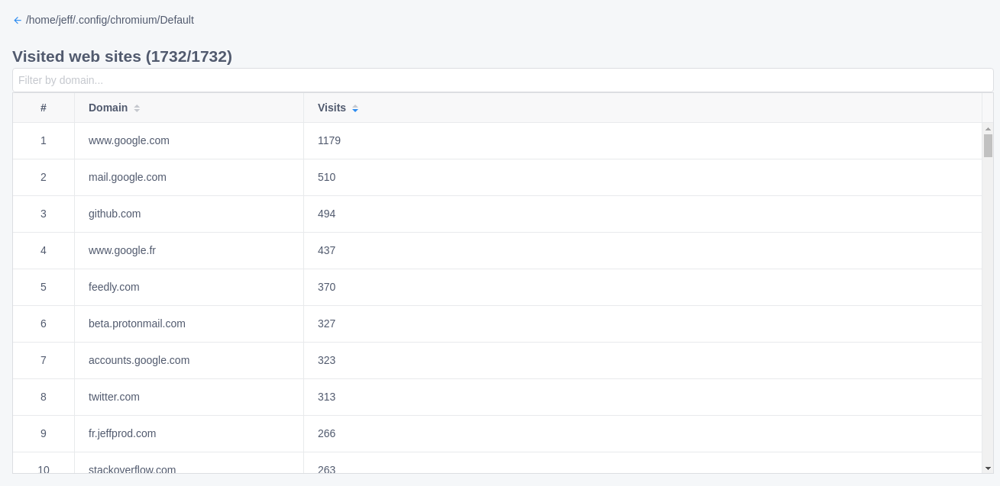
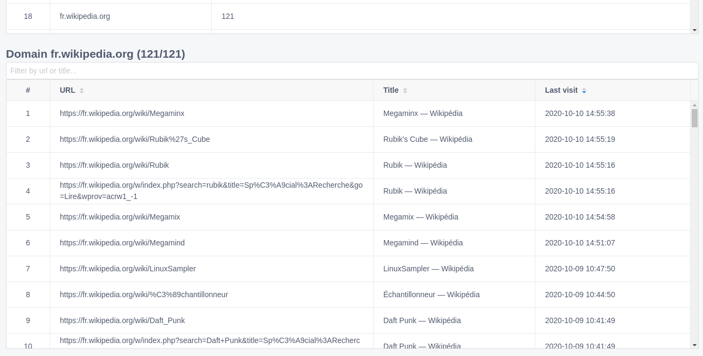
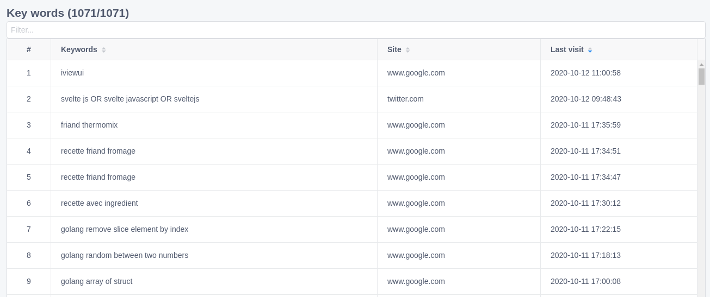

# BrowserHistory

Forensics for Chrome/Chromium based browsers.

Features :

- visited web sites
- domain related urls
- downloads
- user logins
- bookmarks

## Visited web sites



## Domain related urls



## Keywords searches



## Download

[Get a release](https://github.com/Tazeg/browserhistory/releases)

## Develop

```bash
git clone https://github.com/Tazeg/browserhistory.git
cd electron
npm install
npm run dev
```

### Linter

```bash
cd electron
npm run lint
```

### Build from source

```bash
cd electron
npm run buildlin # Linux 64
npm run buildwin # Windows 64
```
